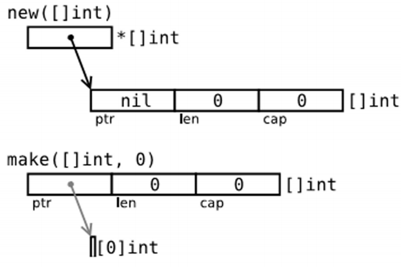

# 数组

**格式**

```
var identifier [len]type
```

如：`var arr1 [5]int`

长度5，索引范围`len(arr1)-1`，第一个元素是 `arr1[0]`

- 对索引项为 i 的数组元素赋值可以这么操作：`arr[i] = value`，所以数组是 **可变的**。

- len可以以...代替，由程序自己去计算数组有几位：`a := [...]string{"a", "b", "c", "d"}`

- Go 语言中的数组是一种 **值类型**，所以可以通过 `new()` 来创建： `var arr1 = new([5]int)`

  - 那么这种方式和 `var arr2 [5]int` 的区别是什么呢？arr1 的类型是 `*[5]int`，而 arr2 的类型是 `[5]int`。

    这样的结果就是当把一个数组赋值给另一个时，需要再做一次数组内存的拷贝操作。例如：

    ```go
    arr2 := *arr1
    arr2[2] = 100
    ```

- 数组通常是一维的，但是可以用来组装成多维数组，例如：`[3][5]int`，`[2][2][2]float64`。

## 几种数组的常见写法

1. ```go
   var arrAge = [5]int{18, 20, 15, 22, 16}
   ```

   比较常见的写法

2. ```go
   var arrLazy = [...]int{5, 6, 7, 8, 22}
   ```

   不必去算有几个元素

3. ```go
   var arrKeyValue = [5]string{3: "Chris", 4: "Ron"}
   ```

   `key: value` 语法，只有索引 3 和 4 被赋予实际的值，其他元素都被设置为空的字符串

# 切片

切片（slice）是对数组一个连续片段的引用，所以切片是一个引用类型。声明切片的格式是： `var identifier []type`（不需要说明长度）。切片的初始化格式是：`var slice1 []type = arr1[start:end]`，这表示 slice1 是由数组 arr1 从 `start` 索引到 `end-1` 索引之间的元素构成的子集。

- 可以由 `len()` 函数获取长度, 切片提供了计算容量的函数 `cap()` 可以测量切片最长可以达到多少
- 切片是引用，所以它们不需要使用额外的内存并且比使用数组更有效率，所以在 Go 代码中切片比数组更常用
- `var slice1 []type = arr1[:]` 那么 slice1 就等于完整的 arr1 数组，`[:]`等同于`[0:len(arr1)]`

## 用 make() 创建一个切片

make 接受 2 个参数：元素的类型以及切片的元素个数。

`var slice1 []type = make([]type, len)`，也可以简写为 `slice1 := make([]type, len)`，这里 `len` 是数组的长度并且也是 `slice` 的初始长度。

- 所以定义 `s2 := make([]int, 10)`，那么 `cap(s2) == len(s2) == 10`。
- 如果你想创建一个 slice1，它不占用整个数组，而只是占用以 len 为个数个项，那么只要：`slice1 := make([]type, len, cap)`

- 以下两种方法可以生成相同的切片：

  ```go
  make([]int, 50, 100)
  new([100]int)[0:50]
  ```

## bytes 包

类型 `[]byte` 的切片十分常见，Go 语言有一个 bytes 包专门用来提供这种类型的操作方法。

### Buffer

```go
import "bytes"

type Buffer struct {
	...
}
```

- 这是一个长度可变的 bytes 的 buffer，提供 Read 和 Write 方法，因为读写长度未知的 bytes 最好使用 buffer。

- 定义：`var buffer bytes.Buffer`，或者使用 new 获得一个指针：`var r *bytes.Buffer = new(bytes.Buffer)`，或者通过函数：`func NewBuffer(buf []byte) *Buffer`，创建一个 Buffer 对象并且用 buf 初始化好；NewBuffer 最好用在从 buf 读取的时候使用。

```go
var buffer bytes.Buffer
for {
	if s, ok := getNextString(); ok { //method getNextString() not shown here
		buffer.WriteString(s)
	} else {
		break
	}
}
fmt.Print(buffer.String(), "\n")
```

创建一个 buffer，通过 `buffer.WriteString(s)` 方法将字符串 s 追加到后面，最后再通过 `buffer.String()` 方法转换为 string：这种实现方式比使用 `+=` 要更节省内存和 CPU，尤其是要串联的字符串数目特别多的时候。

## 切片重组（reslice）

改变切片长度的过程称之为切片重组 **reslicing**，做法如下：`slice1 = slice1[0:end]`，其中 end 是新的末尾索引（即长度）。

将切片扩展 1 位可以这么做：

```go
sl = sl[0:len(sl)+1]
```

- 切片可以反复扩展直到占据整个相关数组。

```go
var ar = [10]int{0,1,2,3,4,5,6,7,8,9}
var a = ar[5:7] // reference to subarray {5,6} - len(a) is 2 and cap(a) is 5
```

将 a 重新分片：

```go
a = a[0:4] // ref of subarray {5,6,7,8} - len(a) is now 4 but cap(a) is still 5
```

## 切片的复制与追加

切片的复制： `func copy(dst, src []T) int`

- copy 方法将类型为 T 的切片从源地址 src 拷贝到目标地址 dst，**覆盖 dst 的相关元素**

- 返回拷贝的元素个数

- ```go
  slFrom := []int{1, 2, 3}
  slTo := make([]int, 10)
  
  n := copy(slTo, slFrom)
  ```

- 如果 src 是字符串那么元素类型就是 byte

- 如果你还想继续使用 src，在拷贝结束后执行 `src = dst`。

切片的追加：`func append(s[]T, x ...T) []T`

- append 方法将 0 个或多个具有**相同类型** s 的元素追加到切片后面并且返回新的切片

- ```go
  sl3 := []int{1, 2, 3}
  sl3 = append(sl3, 4, 5, 6)
  ```

- 如果 s 的容量不足以存储新增元素，append 会分配新的切片来保证已有切片元素和新增元素的存储。

- 追加过程示例

  ```go
  func AppendByte(slice []byte, data ...byte) []byte {
  	m := len(slice)
  	n := m + len(data)
  	if n > cap(slice) { // if necessary, reallocate
  		// allocate double what's needed, for future growth.
  		newSlice := make([]byte, (n+1)*2)
  		copy(newSlice, slice)
  		slice = newSlice
  	}
  	slice = slice[0:n]
  	copy(slice[m:n], data)
  	return slice
  }
  ```

- 你可以使用append实现更多操作，如：
  - 将切片 b 的元素追加到切片 a 之后：`a = append(a, b...)`
  - 删除位于索引 i 的元素：`a = append(a[:i], a[i+1:]...)`
    - 切除切片 a 中从索引 i 至 j 位置的元素：`a = append(a[:i], a[j:]...)`
  - 为切片 a 扩展 j 个元素长度：`a = append(a, make([]T, j)...)`
  - 在索引 i 的位置插入元素 x：`a = append(a[:i], append([]T{x}, a[i:]...)...)`
    - 在索引 i 的位置插入长度为 j 的新切片：`a = append(a[:i], append(make([]T, j), a[i:]...)...)`
    - 在索引 i 的位置插入切片 b 的所有元素：`a = append(a[:i], append(b, a[i:]...)...)`
  - 取出位于切片 a 最末尾的元素 x：`x, a = a[len(a)-1], a[:len(a)-1]`

## 切片和垃圾回收

切片的底层指向一个数组，该数组的实际容量可能要大于切片所定义的容量。只有在没有任何切片指向的时候，底层的数组内存才会被释放，这种特性有时会导致程序占用多余的内存。

**示例** 函数 `FindDigits` 将一个文件加载到内存，然后搜索其中所有的数字并返回一个切片。

```go
var digitRegexp = regexp.MustCompile("[0-9]+")

func FindDigits(filename string) []byte {
    b, _ := ioutil.ReadFile(filename)
    return digitRegexp.Find(b)
}
```

这段代码可以顺利运行，但返回的 `[]byte` 指向的底层是整个文件的数据。只要该返回的切片不被释放，垃圾回收器就不能释放整个文件所占用的内存。换句话说，一点点有用的数据却占用了整个文件的内存。

想要避免这个问题，可以通过拷贝我们需要的部分到一个新的切片中：

```go
func FindDigits(filename string) []byte {
   b, _ := ioutil.ReadFile(filename)
   b = digitRegexp.Find(b)
   c := make([]byte, len(b))
   copy(c, b)
   return c
}
```

事实上，上面这段代码只能找到第一个匹配正则表达式的数字串。要想找到所有的数字，可以尝试下面这段代码：

```go
func FindFileDigits(filename string) []byte {
   fileBytes, _ := ioutil.ReadFile(filename)
   b := digitRegexp.FindAll(fileBytes, len(fileBytes))
   c := make([]byte, 0)
   for _, bytes := range b {
      c = append(c, bytes...)
   }
   return c
}
```

# 字符串、数组和切片的应用

- 假设 s 是一个字符串（本质上是一个字节数组），那么就可以直接通过 `c := []byte(s)` 来获取一个字节的切片 c 

  - 可以通过 copy 函数来达到相同的目的：`copy(dst []byte, src string)`。

- Unicode 字符会占用 2 个字节，有些甚至需要 3 个或者 4 个字节来进行表示。

  - 可以使用 `c := []int32(s)` 语法，这样切片中的每个 int 都会包含对应的 Unicode 代码，因为字符串中的每个字符都会对应一个整数。
  - 也可以将字符串转换为元素类型为 rune 的切片：`r := []rune(s)`
  - 可以通过代码 `len([]int32(s))` 来获得字符串中字符的数量，但使用 `utf8.RuneCountInString(s)` 效率会更高一点。

- 可以将一个字符串追加到某一个字节切片的尾部

  ```go
  var b []byte
  var s string
  b = append(b, s...)
  ```

- 获取字符串的某一部分`substr := str[start:end]`

- 字符串的内存结构：一个字符串实际上是一个双字结构，即一个指向实际数据的指针和记录字符串长度的整数

- 修改字符串中的某个字符

  - Go 语言中的字符串是不可变的，无法通过`str[i] = 'D'`去修改字符串中的某个字符

  - 必须先将字符串转换成字节数组，然后再通过修改数组中的元素值来达到修改字符串的目的，最后将字节数组转换回字符串格式

    ```go
    s := "hello"
    c := []byte(s)
    c[0] = 'c'
    s2 := string(c) // s2 == "cello"
    ```

- 字节数组对比函数：对比两个字节数组，相同返回0，如果a[i] > b [i]返回1，否则返回-1

  - ```go
    func Compare(a, b[]byte) int {
        for i:=0; i < len(a) && i < len(b); i++ {
            switch {
            case a[i] > b[i]:
                return 1
            case a[i] < b[i]:
                return -1
            }
        }
        // 数组的长度可能不同
        switch {
        case len(a) < len(b):
            return -1
        case len(a) > len(b):
            return 1
        }
        return 0 // 数组相等
    }
    ```

  - 搜索和排序：标准库提供了 `sort` 包来实现常见的搜索和排序操作。
    - sort 包中的函数`func Ints(a []int)`来实现对 int 类型的切片排序。例如`sort.Ints(arri)`
      - 类似的，可以使用函数 `func Float64s(a []float64)` 来排序 float64 的元素，或使用函数 `func Strings(a []string)` 排序字符串元素。
    - 为了检查某个数组是否已经被排序，可以通过函数 `IntsAreSorted(a []int) bool` 来检查，如果返回 true 则表示已经被排序。
    - 想要在数组或切片中搜索一个元素，该数组或切片必须先被排序（因为标准库的搜索算法使用的是二分法）。然后，您就可以使用函数 `func SearchInts(a []int, n int) int` 进行搜索，并返回对应结果的索引值。
      - 搜索float64：`func SearchFloat64s(a []float64, x float64) int`
      - 搜索string：`func SearchStrings(a []string, x string) int`

# new() 和 make() 的区别

看起来二者没有什么区别，都在堆上分配内存，但是它们的行为不同，适用于不同的类型。

- new(T) 为每个新的类型 T 分配一片内存，初始化为 0 并且返回类型为 *T 的内存地址：这种方法 **返回一个指向类型为 T，值为 0 的地址的指针**，它适用于值类型如数组和结构体（参见第 10 章）；它相当于 `&T{}`。
- make(T) **返回一个类型为 T 的初始值**，它只适用于 3 种内建的引用类型：切片、map 和 channel。
- 换言之，new 函数分配内存，make 函数初始化



*1.slice、map 以及 channel 都是 golang 内建的一种引用类型，三者在内存中存在多个组成部分， 需要对内存组成部分初始化后才能使用，而 make 就是对三者进行初始化的一种操作方式*

*2. new 获取的是存储指定变量内存地址的一个变量，对于变量内部结构并不会执行相应的初始化操作， 所以 slice、map、channel 需要 make 进行初始化并获取对应的内存地址，而非 new 简单的获取内存地址*

# For-range 结构

可以应用于数组与切片，用来遍历

```go
for ix, value := range slice1 {
	...
}
```

- 如果只需要索引`for ix := range seasons` 
- 如果只需要值`for _, value := range seasons` 

**问题7.5**

数组中item的值便不会double

测试代码以及让数组值double的代码：

```go
package chapter7

import "fmt"

// 原题目中的方式
func ValueDoubleV1() {
	items := [...]int{10, 20, 30, 40, 50}

	for _, item := range items {
		item *= 2
	}

	fmt.Printf("Items value: %v", items)
}

// 让值double
func ValueDoubleV2() {
	items := [...]int{10, 20, 30, 40, 50}
	
	for idx := range items {
		items[idx] *= 2
	}

	fmt.Printf("Items value: %v", items)
}
```

测试结果：

```
=== RUN   TestQuestion7_5
Items value: [10 20 30 40 50]    c:\Users\SSR\Documents\Go\src\github.com\TheWayToGo\chapter7\chapter_test.go:25:
        **** double Items value ****
Items value: [20 40 60 80 100]--- PASS: TestQuestion7_5 (0.00s)
PASS
ok      go.mod/github.com/TheWayToGo/chapter7   0.609s
```

